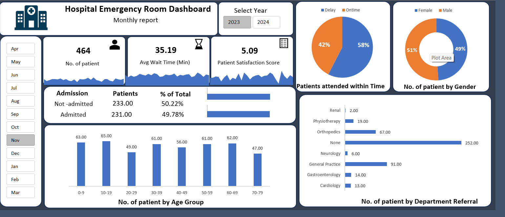

# 🏥 Hospital Emergency Room Analysis Dashboard

## 📌 Project Overview

The Hospital Emergency Room Analysis Dashboard is an interactive Excel dashboard created to analyze ER operations and provide meaningful insights for improving patient management and hospital efficiency.

This dashboard helps stakeholders monitor patient flow, wait times, satisfaction levels, and departmental referrals to support better decision-making.

---

## 🎯 Project Objectives

* Monitor daily ER patient visits
* Analyze patient wait times
* Track patient satisfaction trends
* Identify operational bottlenecks
* Improve service efficiency using data-driven insights

---

## 📊 Key Performance Indicators (KPIs)

### 👥 Number of Patients

* Total number of patients visiting the ER daily
* Daily trend analysis using sparklines

### ⏳ Average Wait Time

* Average waiting time before seeing a medical professional
* Trend tracking to identify peak delays

### ⭐ Patient Satisfaction Score

* Daily average satisfaction score analysis
* Helps evaluate service quality and patient experience

---

## 📈 Dashboard Visualizations

### ✅ Patient Admission Status

Comparison of:

* Admitted Patients
* Non-Admitted Patients

### 👶 Patient Age Distribution

Patients grouped into different age categories for demographic analysis.

### ⏱ Timeliness Analysis

Percentage of patients attended within 30 minutes.

### 👨‍⚕️ Gender Analysis

Distribution of patients by gender.

### 🏥 Department Referrals

Analysis of the departments receiving the highest patient referrals.

---

## 🛠 Tools & Technologies Used

* Microsoft Excel
* Power Query
* Pivot Tables
* Pivot Charts
* Slicers
* Data Cleaning
* Dashboard Design
* Data Modeling

---

## 📷 Dashboard Preview

---

## 📚 Learning Outcome

Through this project, I improved my skills in:

* Data cleaning and transformation
* Interactive dashboard development
* Healthcare data analysis
* Data visualization
* Excel data modeling and slicers

---

## 🙏 Acknowledgement

This project was created while learning Excel Dashboarding concepts from Satish Dhawale.

---

## 📌 Author

Himani Kotnala
---

## 🔗 Connect With Me
LinkedIn: [Himani Kotnala](https://www.linkedin.com/in/himani-kotnala-30a532311/)

GitHub: GitHub: [himanikotnala](https://github.com/himanikotnala)
